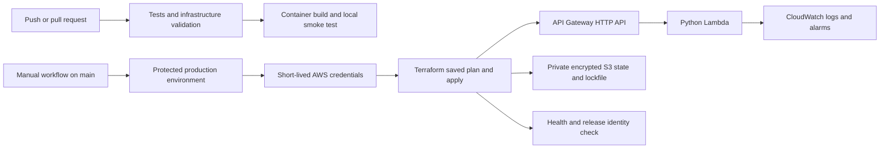

# ReleaseOps

A reproducible release verification service with Python, Docker, GitHub Actions,
Terraform and an optional AWS Lambda deployment in London (`eu-west-2`).

ReleaseOps checks that a deployed service is healthy and running the expected
commit. The repository includes the application, automated checks, infrastructure
configuration and the operational steps needed to investigate a failed release.

The [verification record](docs/verification.md) lists completed checks and their
scope. The application and Terraform configuration have been validated locally.
AWS deployment remains an optional step and has not been performed.

## Run locally at no cloud cost

Requires Python 3.13 or later. No third-party Python packages are required.

```sh
python -m unittest discover -s tests -v
python -m app.service
```

In another terminal:

```sh
python scripts/smoke.py http://127.0.0.1:8080 --expected-version local
python scripts/package_lambda.py
```

On Windows, use `py -3` if `python` is unavailable.

| Route | Result |
| --- | --- |
| `/healthz` | Process health |
| `/readyz` | Readiness for this stateless service |
| `/version` | Release identifier from `APP_VERSION` |
| Unknown routes | 404 |
| Write methods | 405 |

## Run as a hardened local container

```sh
docker build --pull -t releaseops:local .
docker run --rm --read-only --cap-drop=ALL --security-opt=no-new-privileges --pids-limit=100 --memory=128m --cpus=0.5 -p 127.0.0.1:8080:8080 releaseops:local
```

The image runs as UID 10001 and includes a health check. The local
HTTP service based on Python's standard server, bound to localhost by default.
The AWS path uses Lambda instead of that HTTP server.

## Delivery pipeline

Pushes to main and pull requests run tests, create a deterministic Lambda ZIP,
check Terraform formatting and validation without AWS credentials, then build
and smoke-test the container. Read-only repository permissions are sufficient.
The manual AWS workflow runs only from main and uses short-lived OIDC credentials.

The deployment uses saved Terraform plans, encrypted remote state with S3 locking,
and a smoke test that checks both health and the exact deployed commit identifier.
Dependabot proposes Action, Docker and provider updates. Actions are pinned to
verified commit SHAs. The Docker base image still uses a mutable minor tag; pin
a reviewed image digest before using this pattern in a production repository.

## Architecture



Read [AWS setup](docs/aws-setup.md), [operations](docs/runbook.md) and
[architecture decisions](docs/decisions.md). Publishing this repository does not
deploy AWS resources. Deployment requires separate account and spending approval.

## Further work

- Link the first successful CI run and record its commit SHA.
- Explain a deliberately failed smoke test and the fix.
- Capture your own Terraform plan, deployment logs and teardown evidence after an authorised AWS exercise.
- Extend the API and tests together, then verify the release identifier after deployment.
- Review the design questions in [interview walkthrough](docs/interview-walkthrough.md).

The current configuration targets a small demonstration workload. Production use
would need stronger release controls, measured service objectives and review of
the account's security and availability requirements.
